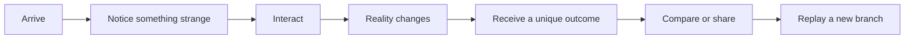

# SHOCKME

## Product specification · v0.1

> **SHOCKME keeps you wondering what happens next.**

*Authored by the Oracle. Adopted as the v0 contract 2026-08-07.*

---

## 00 · The invitation

SHOCKME is a browser-based entertainment platform where visitors encounter strange, surprising, playful, and memorable interactive experiences.

The site is not horror, gore, murder, illegal activity, or distress content. Its shock comes from **strangeness, surprise, absurdity, beauty, humor, impossible interactions, and personal variation**.

The promise is simple:

> **You didn't find the same website they did.**

The success condition is not time-on-page by itself. It is the moment a visitor says:

> "Wait… what was that?"

and sends the link to someone else.

---

## 01 · Product principles

| Principle | Meaning |
|---|---|
| Strange is the identity | SHOCKME should feel like a website operating under unexplained rules. |
| Entertainment is the product | Every screen must give the visitor something interesting to notice, choose, test, or discover. |
| Divergence is real | Two people can enter the same experience and receive different perspectives and outcomes. |
| Mystery has restraint | The experience delays explanation without becoming confusing, hostile, or distressing. |
| Memory must be honest | "The site remembers" is powered by an anonymous visitor-controlled cookie, never covert profiling. |
| Replay should matter | A replay is a new branch of reality, not a cosmetic reshuffle. |
| NEDB is the substrate | Persistent, causal, verifiable state makes the strange world possible. |

---

## 02 · Safety boundary

SHOCKME must remain:

- non-violent and non-graphic;
- legal and harmless;
- playful rather than threatening;
- transparent about what data it uses;
- free of fake surveillance claims;
- usable without an account;
- respectful of accessibility preferences and reduced-motion settings.

No gore, murder, instructions for wrongdoing, graphic violence, doxxing, impersonation, or manipulation intended to cause real-world distress.

The site may be uncanny. It must never make an ordinary visitor believe their device, identity, or physical safety is compromised.

---

## 03 · Experience loop



The visitor should always know what they can do next, even when they do not know why the interface is behaving that way.

### Strange interaction examples

- A button apologizes before it is clicked.
- The page greets the visitor with a sentence they did not type.
- A harmless object appears in several unrelated scenes.
- A room changes depending on how long the visitor looks at it.
- Two contradictory options both appear to work.
- The visitor sees a message meant for another perspective.
- The closing artifact says: "You were not supposed to see this version."

These are creative patterns, not a fixed script. The experience registry must support many future experiences.

---

## 04 · The three planes

### Public plane — Portal

The public plane is server-rendered, cacheable, indexable, and shareable. It contains:

- the invitation page;
- `/artifact/:token` personalized artifact permalinks;
- `/compare/:a/:b` divergence comparison pages;
- honest metadata, canonical URLs, JSON-LD, and sitemap entries;
- machine twins via `.md` and `?format=json`.

The public plane never exposes private session state, raw seeds, NEDB sequence numbers, or internal hashes.

### Anomaly plane — SPA

The anomaly plane is the actual interactive experience. Portal serves its shell; the browser then connects to the BFF.

- Per-visitor and intentionally `noindex`.
- Receives resolved scene descriptors, never the generator or session seed.
- Uses WebSocket only for resolved, visitor-safe events.
- Supports replay, reduced motion, and a visible way to burn anonymous history.

### BFF — Portal-shaped boundary

The BFF is the only component that has ever heard of `nedbd`.

The browser holds an opaque session cookie and nothing else. Routes are narrow, intent-shaped operations—not a generic database proxy:

```text
POST /bff/observe
POST /bff/choose
POST /bff/dwell
POST /bff/replay
POST /bff/compare
GET  /bff/state
WS   /bff/broadcast
```

The browser vocabulary is `sceneId`, `choiceId`, and `dwellMs`. It never receives `seq`, `hash`, `caused_by`, collection names, or the session seed.

---

## 05 · NEDB reality engine

NEDB is required. It is not a replaceable persistence detail; it is the engine that allows SHOCKME's world to remember, branch, mutate, and verify itself.

Use one database, `NEDB_DB=shockme`, with logical isolation by tags. Use flat relation keys for lookups (`sessionId`, `experienceId`, `visitorId`). Use causal links for provenance, not cross-collection joins.

### Collections

| Collection | Purpose |
|---|---|
| `visitors` | Anonymous, rotatable visitor identities. |
| `sessions` | Current and parent/replay session state. |
| `experiences` | Content-addressed experience registry entries. |
| `scenes` | Scene definitions and resolved variants. |
| `events` | Immutable interaction and transition events. |
| `encounters` | Visitor-specific perspective of a shared event. |
| `artifacts` | Final visitor-facing outcomes. |
| `broadcasts` | One global event observed through divergent perspectives. |
| `experience_versions` | Content and world-state version history. |

Every meaningful transition is an append-only event with a `caused_by` parent. Seed loading is content-addressed and idempotent: re-running it writes zero duplicate rows.

### Required service abstractions

```text
createVisitor()
createSession()
appendExperienceEvent()
getSessionState()
getSessionStateAsOf()
assignExperience()
generateVariation()
publishBroadcast()
observeBroadcast()
createArtifact()
createComparisonToken()
replaySession()
verifyExperienceHistory()
```

The repository layer owns NEDB details. The BFF owns authorization, session resolution, and response shaping. The client sees only resolved experience data.

### Determinism and replay

The original session seed reproduces the visitor's experience exactly. A replay derives a child seed from the parent seed, replay index, and current global world state. Replays form a verifiable tree rather than a reshuffled deck.

### Shared divergence

One broadcast is written once. Each observer receives a perspective-specific encounter. Comparison tokens reveal that visitors diverged without exposing identity or private session state.

### Verification as atmosphere

`verifyExperienceHistory()` should surface late in the experience as an in-world artifact line—not as an admin screen. Tamper evidence becomes part of the fiction while remaining technically real.

---

## 06 · First complete experience: The Waiting Room

The visitor enters a beautifully designed waiting room. Nothing is dangerous. Everything is slightly off.

### Suggested progression

1. **Arrival:** the room welcomes the visitor with a sentence that changes between sessions.
2. **Observation:** a clock, chair, plant, or notice behaves according to dwell time.
3. **Choice:** the visitor chooses whether to inspect, wait, or leave.
4. **Divergence:** the room reveals a different object or message depending on their path.
5. **Broadcast:** a harmless global event occurs, but each visitor sees a different version of it.
6. **Artifact:** the visitor receives a polished "what happened to you" card.
7. **Comparison:** they can compare their version with another visitor's without identifying either person.
8. **Replay:** the waiting room returns, but it is now a genuinely different branch.

The impossible interaction must be harmless and legible as a rule. It should feel intentional rather than broken.

---

## 07 · Visual direction

SHOCKME should look like a premium interactive art installation, not a dashboard.

### Visual language

- Near-black foundations with high-contrast paper, chrome, acid green, electric violet, or warm amber accents.
- Editorial typography: one expressive display face paired with a calm, readable sans-serif.
- Large negative space and deliberate asymmetry.
- Soft grain, subtle scan lines, glass, shadows, and precise motion used sparingly.
- Microcopy that is concise, confident, and slightly wrong.
- Buttons and controls that feel physical and consequential.
- Animations that reward attention rather than overwhelm it.

### Accessibility

- Full keyboard support.
- Strong focus states.
- Reduced-motion mode.
- Text alternatives for visual anomalies.
- No essential information conveyed by color alone.
- Clear reset and exit controls.

### Public artifact design

Artifacts should be beautiful enough to share as screenshots or links. They should show the visitor's harmless variation without exposing private identifiers or raw engine data.

---

## 08 · Experience model

```ts
type Experience = {
  id: string;
  version: string;
  title: string;
  invitation: string;
  scenes: Scene[];
  initialSceneId: string;
};

type Scene = {
  id: string;
  title: string;
  renderer: string;
  copy: string;
  choices: Transition[];
  timedEvents?: TimedEvent[];
  variation?: Variation;
};

type Transition = {
  id: string;
  label: string;
  nextSceneId: string;
  conditions?: BranchCondition[];
};

type BranchCondition = {
  field: string;
  operator: 'equals' | 'gt' | 'lt' | 'contains';
  value: string | number | boolean;
};

type TimedEvent = {
  afterMs: number;
  eventId: string;
  once: boolean;
};

type Variation = {
  key: string;
  options: string[];
  deterministic: boolean;
};

type Artifact = {
  id: string;
  sessionId: string;
  experienceId: string;
  title: string;
  body: string;
  comparisonToken: string;
};

type ReplaySeed = {
  parentSessionId: string;
  replayIndex: number;
  derivedSeed: never; // server-only; never serialized to the browser
};
```

---

## 09 · Implementation stack

- React + TypeScript + Vite
- Framer Motion
- Three.js/WebGL only where useful
- Node.js BFF
- WebSocket broadcast channel
- NEDB daemon and `nedb-engine-client`
- pnpm workspace with `engine`, `bff`, and `portal` packages
- Real `nedbd` in integration tests; no storage mocks for the live suite

---

## 10 · v0 delivery boundary

### Ships in v0

- One complete experience: The Waiting Room.
- Anonymous sessions and honest returning-visitor memory.
- Deterministic branching.
- Replay branching.
- NEDB append-only event history.
- Shared broadcast with divergent perspectives.
- Personalized artifact.
- Comparison page.
- Public Portal pages and machine twins.
- Experience registry proving a second experience can be added without engine changes.
- Live tests for determinism, divergence, replay, idempotent seeding, durability, and verification.

### Deliberately deferred

- Accounts and social profiles.
- Advertising.
- Third-party tracking.
- User-authored experiences.
- Mobile native apps.
- Moderated public submissions.
- Large-scale recommendation feeds.

Scope discipline matters: one experience done completely is more valuable than several shallow experiments.

---

## 11 · Acceptance criteria

SHOCKME v0 is ready when:

1. Two visitors can enter the same experience and receive genuinely different resolved scenes.
2. The session seed never appears in browser-visible payloads or bundles.
3. Reloading reproduces the current session state.
4. Replay creates a new branch linked to the parent.
5. A global broadcast is written once and observed through distinct perspectives.
6. An artifact can be shared without exposing visitor identity.
7. A content-addressed seed run is idempotent.
8. A killed and restarted `nedbd` preserves the required state.
9. History verification passes for an intact session.
10. The public pages render as real HTML for a stranger and a crawler.
11. The anomaly plane is `noindex`.
12. The experience remains safe, playful, and entertaining without relying on fear or violence.

---

## Closing statement

SHOCKME is a place people visit because they want to discover what strange thing happens to them today.

The surface is entertainment.

The engine is memory.

The magic is that nobody can be certain they saw the same world.

---

## Implementation notes · deltas from as-built

*Maintained by Vex. Anything here is a deviation or an open question against the spec above — not a silent reinterpretation of it.*

| Spec says | As built | Status |
|---|---|---|
| `nedb-engine-client` | Hand-rolled `packages/engine/src/nedb.ts` | **Open question for M.** The hand-rolled transport is zero-dependency and encodes the `_id`-not-`id` gotcha directly in `eq()`, which is what killed the "TRACE is broken" folklore. Swapping to the official client is a one-file change if preferred. |
| `Variation.options: string[]` | Per-observer substitution table in `world.ts` | Compatible; the world layer is a superset. Reconcile when scene variations land. |
| — | Deterministic bot population + chat stream | **Addition** (M's call, 2026-08-07): the room must feel inhabited. No LLM in the loop, so it stays free, safe, and AS-OF replayable. |
| Divergence "is real" | ~13% of lines observed diverging vs ~34% targeted | **Known gap.** Substitution only fires when a swappable noun is present. Widening the table is a tracked task. |
